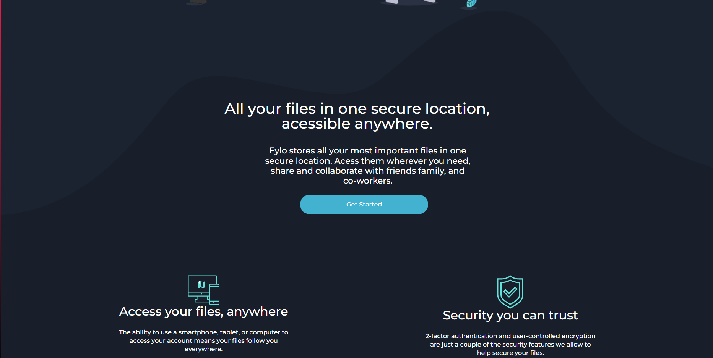
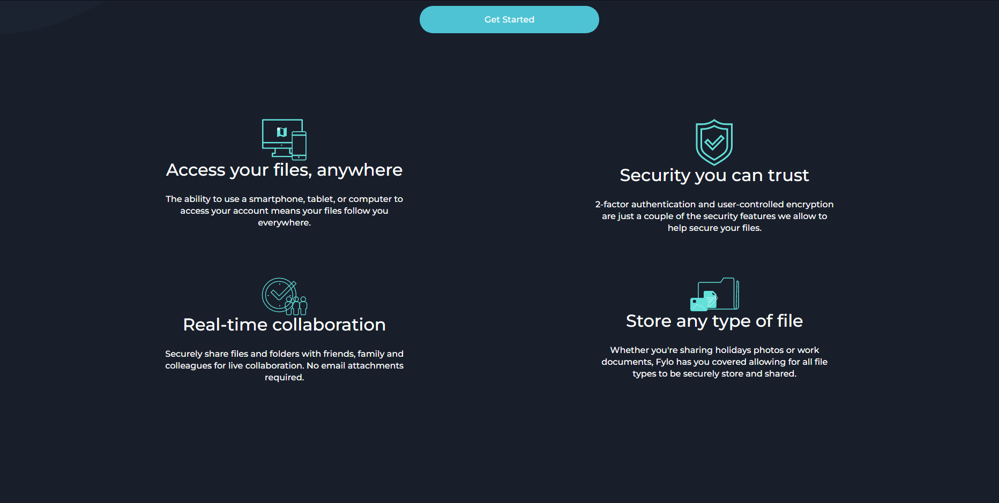
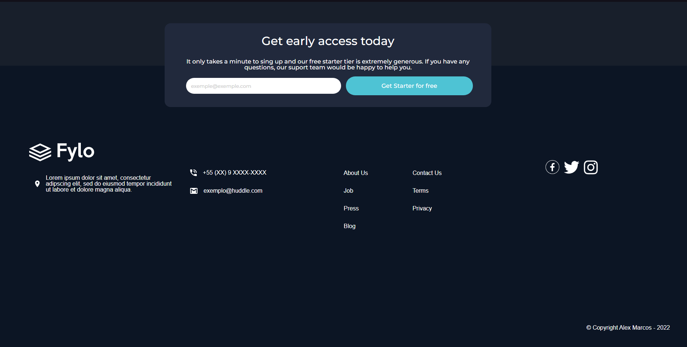

<h1 align="centre"> Fylo dark theme landing page</h1>

O projeto tem como intuito colocar em prática as habilidades que adquiri com HTML e CSS, principalmente utilizando Grid para a   estruturação de objetos na tela. O projeto foi iniciado no dia 30/07/2022 e finalizado no dia **06/08/2022** também aprimorando  

Esse projeto tem como por propósito os seguintes objetivos:

* - Criação de páginas.
* - Prática de HTML e CSS.
* - Utilização de imagens em background junto com cores para um design mais complexo.
* - Interação com os elementos ao passar o mouse por cima.
* - Utilização do display Grid.

<h2 align="centre"> Origem do desafio</h2>

O desafio foi retirado do site Frontend Mentor. 
Link para o desafio:
https://www.frontendmentor.io/challenges/fylo-dark-theme-landing-page-5ca5f2d21e82137ec91a50fd

**Para completar o desafio você precisa de entendimento basico de HTML e CSS**

## O Desafio

Além dos testes abaixo pretendo me desafiar criando um botão que vai alterar de modo diurno/noturno todo o layout da página.

Seu desafio é fazer com que a sua página fiquei o mais parecido possível com a página de exemplo.

Você é livre para usar quaisquer ferramentas que desejar/achar necessario.

Os usuarios devem ser capazes de: 

- Ver o site de maneira otimizada independente do dispositivo ou tela.
- Ver interação com os elementos da página toda vez que passar o mouse por cima delas.

<h2 align="centre">Imagens dos resultados</h2>

# Imagens do desafio: 

# Imagens do resultado:

<h2 align="centre">Tecnologias Utilizadas</h2>

     
   
       
       
    

## Clique no link abaixo para vizualizar: 
https://alex-marcos.github.io/fyloDarkTheme/index.html
